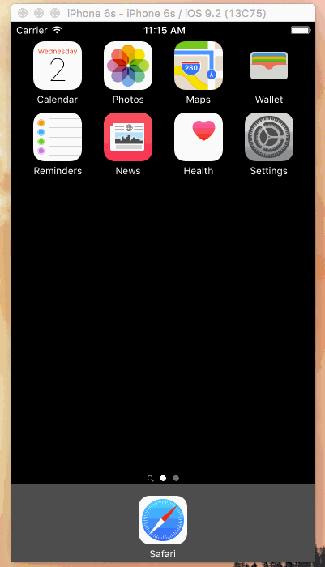
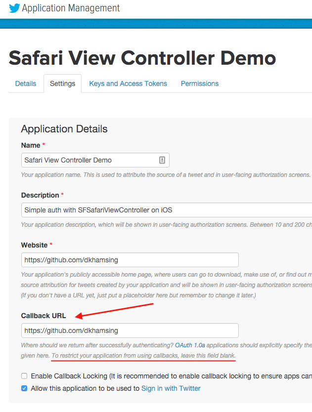
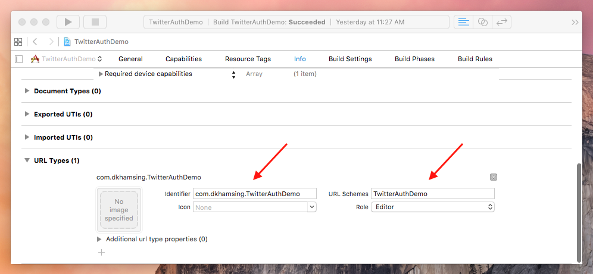

# TwitterSafariViewControllerAuth

Twitter OAuth Login with Safari View Controller on iOS

[](https://travis-ci.org/dkhamsing/TwitterSafariViewControllerAuth)



`TwitterSafariViewControllerAuth` adds Twitter login using Apple's [`SFSafariViewController`](https://developer.apple.com/library/prerelease/ios/documentation/SafariServices/Reference/SFSafariViewController_Ref/index.html), which is [safe for your users ~~`WKWebView`~~ ~~`UIWebView`~~](http://furbo.org/2014/09/24/in-app-browsers-considered-harmful/) :100: :smile:

Bonus: access saved credentials in Safari or use [1Password](https://agilebits.com/onepassword) like a boss.

# Installation

Add the `TwitterSafariViewControllerAuth/` folder to your project.

## Requirements

### Twitter App

A [Twitter app](https://apps.twitter.com/) with a valid `Callback URL` is required: the value entered there is not used but if the field is empty, redirects are disallowed.



### Xcode

A URL scheme for your iOS app is required. In Project Settings → Info: scroll down to **URL Types** and add an entry with `+`

- **Identifier**: your-app-bundle-id, i.e. `com.dkhamsing.TwitterAuthDemo`
- **URL Schemes**: url-scheme, i.e. `TwitterAuthDemo` (if there is only one scheme, this value is read and set as the URL scheme for `TwitterSafariViewControllerAuth`)



# Usage

```objc
// MyViewController.m

static NSString *const kConsumerKey    = @"<YOUR APP CONSUMER KEY>";
static NSString *const kConsumerSecret = @"<YOUR APP CONSUMER SECRET>";

#import "TwitterSafariViewControllerAuth.h"

// ...

// URL Scheme is assumed to be first scheme in bundle plist, to set this manually, use - configureConsumerKey:clientSecret:urlScheme:.
[[TwitterSafariViewControllerAuth sharedInstance] configureConsumerKey:kConsumerKey clientSecret:kConsumerSecret];

[[TwitterSafariViewControllerAuth sharedInstance] presentOAuthLoginFromController:self];
```

```objc
// AppDelegate.m

#import "TwitterSafariViewControllerAuth.h"

- (BOOL)application:(UIApplication *)app openURL:(NSURL *)url options:(NSDictionary<NSString *,id> *)options {
    [[TwitterSafariViewControllerAuth sharedInstance] handleOpenUrl:url options:options success:^(NSDictionary *results) {
        NSLog(@"Results: %@", results);               
        /*
        Results: {
            data = <...>;
            "data_string" = "..."
            "oauth_token" = "...";
            "oauth_token_secret" = "...";
            "screen_name" = dkhamsing;
            "user_id" = ...;
            "x_auth_expires" = 0;
        }
        */
    } failure:nil];

    // ...
}
```

A demo project is included.

# Credits

Based on [`FHSTwitterEngine`](https://github.com/fhsjaagshs/FHSTwitterEngine).

## Contact

- [github.com/dkhamsing](https://github.com/dkhamsing)
- [twitter.com/dkhamsing](https://twitter.com/dkhamsing)

## License

This project is available under the MIT license. See the [LICENSE](LICENSE) file for more info.
